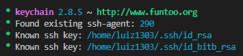
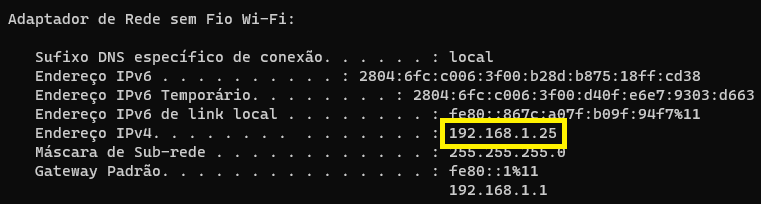
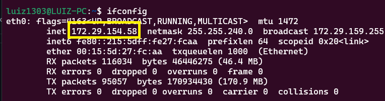
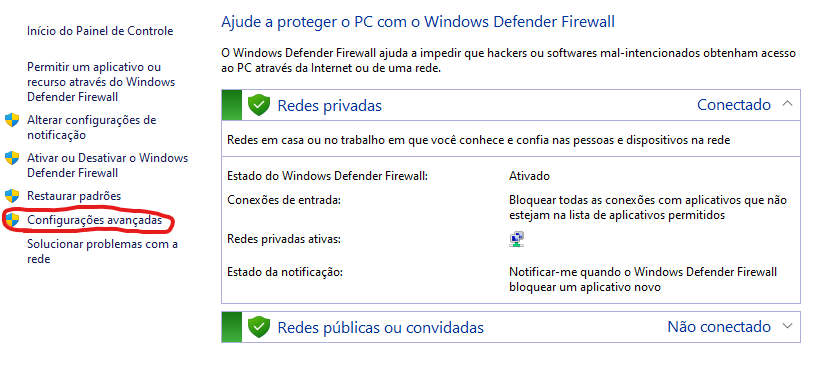
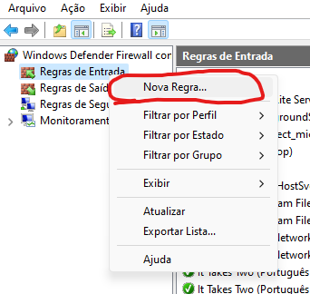
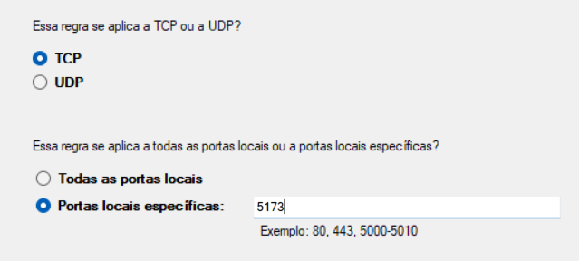
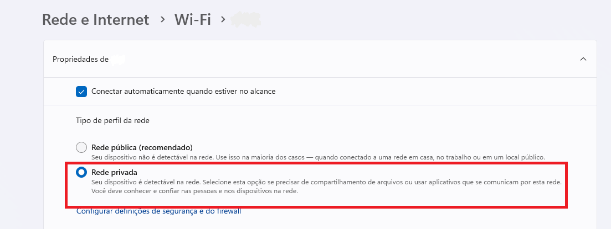
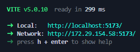

# Comandos base

## 🐧 WSL

- Obter atualizações dos pacotes instalados: `sudo apt update`
- Conferir diretório atual: `pwd`
- Visualizar diretórios ocultos: `ls -a`
- Ver o histórico de comandos: `history`
- Ir para diretório: `cd nome`
- Recuar diretório: `cd ..`
- Criar nova pasta: `mkdir nome-pasta`
- Remover pasta: `rm -rf nomepasta`
- Para criar um arquivo: `touch nome-arquivo`
- Abrir o arquivo com editor nativo (nano): `nano nome-arquivo`
- Visualizar o texto de um arquivo: `cat nome-arquivo`
- Guia sobre comandos: `man nome-comando`
- Para alternar entre o bash e cmd em um mesmo prompt:
  `wsl.exe` ou `cmd.exe`.

  OBS: Ao abrir o bash pelo prompt padrão do windows, ele vai estar no mesmo diretório C://...

<br>

# Para compartilhar chaves SSH entre Windows e WSL:

👉 Baseado no tutorial <a href="https://devblogs.microsoft.com/commandline/sharing-ssh-keys-between-windows-and-wsl-2/">deste link</a> .

## Copiar do Windows para WSL:

Adicione suas chaves SSH no windows dentro do endereço desejado (Normalmente `C:\Users\<username>\.ssh`). Para saber como gerar de forma local e adicionar sua chave SSH na lista de permissões, veja a documentação do servidor que utilizar (GitHub, GitLab, Bitbucket, etc).

No caso do GitHub, já fiz um tutorial <a href="https://github.com/luiz1303/Tutorial_Git">aqui</a> .

Em seguida, abra um novo terminal no WSL (e que esteja no diretorio raíz, como: `Linux/sua-distro/home/seu-username`) e utilize o comando a seguir para copiar a sua pasta .ssh do windows para o WSL:

```
cp -r /mnt/c/Users/<username>/.ssh ~/.ssh
```

OBS: Isso significa que, ao gerar uma nova chave ssh no windows, o comando acima deve ser executado novamente. De forma alternativa, você pode manualmente copiar a pasta .ssh e colar no diretório dentro da sua pasta de usuário no WSL.

## Correção de Permissões

Para corrigir os erros de permissão de acesso, utilize o comando a seguir:

```
chmod 600 ~/.ssh/id_rsa
```

A partir de agora, para facilitar o controle das suas chaves SSH, vamos utilizar o <a href = "https://www.funtoo.org/Funtoo:Keychain">Keychain</a>. Para instalá-lo, execute:

```
sudo apt-get update
sudo apt install keychain
```

Em seguida, vá até o arquivo `~/.bashrc` e adicione o seguinte código:

```

eval `keychain --eval --agents ssh id_rsa`

```

👉 Para realizar o passo acima, você pode utilizar o comando `nano ~/.bashrc` para abrir o editor de texto via terminal e adicionar o código no final do arquivo. Para salvar, pressione `ctrl + x`, depois `y` e, por fim, `enter` para confirmar a gravação.

## E para mais de uma chave?

Por vezes pode ser necessária a adição de mais de uma chave SSH (quando se deseja acessar múltiplas contas no GitHub ou mesmo, usar contas em diferentes servidores).

Para isso, na hora de gerar a chave, ao invés de utilizar o nome padrão `id_rsa`, utilize um nome diferente, como: `id_gitlab_rsa`, por exemplo. Depois é só seguir o mesmo passo a passo (copiar a pasta .ssh do windows para o wsl, corrigir as permissões e adicionar o código no `~/.bashrc`).

Nesse caso, o final do `.bashrc` ficaria assim:

```
eval `keychain --eval --agents ssh id_rsa id_gitlab_rsa id_outra_chave_rsa`
```

## Como saber se deu certo?

Toda vez que iniciar o WSL, o terminal deve exibir uma mensagem como a seguinte:

</img>

Pronto! Agora você pode usar as chaves SSH no WSL sem mais dores de cabeça :) .

`Para mais informações sobre como utilizar um nome diferente de id_rsa ou como definir uma senha em sua criação, por exemplo, leia a documentação do GitHub, GitLab, ou outro servidor que utilizar!`

<br>

# Redirecionando WSL2 para a rede local:

Image o seguinte cenário: Você está desenvolvendo uma aplicação e quer testá-la em um celular em tempo real. Você segue os passos para compartilhar seu servidor de desenvolvimento com a rede local, insere o endereço de ip no seu celular e... nada.

Isso ocorre porque <strong> o WSL não compartilha o mesmo endereço de ip que o seu computador </strong> e, portanto, o endereço que você está tentando acessar é o do WSL, que não está disponível na rede.

Para conferir o seu endereço de ip no Windows, abra abra um Prompt de Comando (CMD) e digite: `ipconfig`:

</img>

Para fazer o mesmo no WSL, abra seu terminal e execute `ifconfig` (o comando pode variar de acordo com a sua distro). Para o Ubuntu:

</img>

Para contornar este problema, é necessário fazer o <strong>Port Forwarding</strong>, ou seja, o redirecionamento de portas entre o WSL e o Windows.

## Permitindo a conexão no Firewall Do Windows

O primeiro passo é garantir que o Firewall permita a conexão de um dispositivo externo ao seu computador. A solução mais simples seria desativar o firewall conforme a rede em que está conectado (Pública ou Privada). Contudo, <strong> isto NÃO é recomendado, visto que você estará expondo o seu computador</strong>.

O melhor caminho é inserir regras de entrada para filtrar o que deverá acontecer. Para isso, abra o Windows Firewall e vá em `Configurações Avançadas`:

</img>

Em seguida, selecione `Regras de Entrada` e, com o botão direito do mouse, selecione `Nova Regra`:

</img>

Escolha a opção `Porta` e avance. Em `Portas locais específicas`, coloque a porta que deseja expor. Isto ficará ao seu critério, mas portas comuns são `3000` ou `5000`, por exemplo. Para seguir o tutorial de uma aplicação com vite, vamos utilizar a porta padrão `5173`.
Dessa forma, quando o passo a passo estiver concluído, será possível acessar sua aplicação pelo link: `<seu-ip-do-windows>:<porta-escolhida>`, como em `192.168.1.25:5173`, por exemplo.

</img>

Após avançar, garante que a opção `Permitir conexão` esteja marcada e avance. Na seção de `Perfil`, marque a opção conforme o seu tipo de rede.

</img>

Geralmente o Wi-Fi de residências são redes privadas, mas você pode conferir o seu caso ao clicar no ícone de rede e ver suas propriedades. <strong>Tome cuidado ao fazer este procedimento em redes abertas, visto que esta porta estará disponível para todos os dispositivos conectados na mesma rede!</strong>

</img>

Por fim, escolha um nome (Como `WSL-PortForwarding-5173`) e clique em concluir.

### Agora, qualquer dispositivo na rede que tentar se conectar ao seu terá permissão através da porta definida.

O próximo passo é garantir que estes dispositivos sejam redirecionados para o endereço do WSL e para isto existem duas alternativas:

- O caminho fácil com Expose-WSL (Válido apenas para WSL rodando Node.js >=14.8.0)
- O caminho manual com PowerShell

## Expose-WSL

Para expor seu app para a rede local, basta executar `npx expose-wsl@latest` (será necessário sempre que iniciar um novo terminal) e confirmar a instalação. Depois, basta rodar o seu servidor como faria normalmente. Para uma aplicação utilizando Vite:

```
npx expose-wsl@latest
npm run dev -- --host
```

</img>

### Pronto! Agora você pode acessar sua aplicação através do endereço de ip do windows e pela porta escolhida!

<br>

## Windows PowerShell

Apesar de ser um pouco mais manual, utilizar o Windows PowerShell permite especificar exatamente o que será redirecionado. Para isto abra o PowerShell como administrador e copie o comando:

```
netsh interface portproxy add v4tov4 listenport=<porta-escolhida> listenaddress=0.0.0.0 connectport=<porta-WSL> connectaddress=<endereco-ip-WSL>
```

Acima, `<porta-escolhida-no-firewall>` equivale a porta que definimos no Windows Firewall. O campo `listenaddress` pode ser mantido com o valor anterior, pois `0.0.0.0` é o mesmo que colocar o endereço de ip do windows.

Da mesma forma, `<porta-WSL>` e `<endereco-ip-WSL>` equivalem ao endereço do WSL que desejamos acessar. `<endereco-ip-WSL>` pode ser descoberto com o comando `ìfconfig`, como explicado anteriormente, enquanto `<porta-WSL>` vai variar de acordo com a porta padrão que está sendo exposta (3000,5000, 6001, etc) em sua aplicação.

Por exemplo, ao rodar uma aplicação vite com `npm run dev -- --host`, é possível descobrir `<endereco-ip-WSL>` e `<porta-WSL>`.

</img>

Dessa forma, o comando completo ficaria:

```
netsh interface portproxy add v4tov4 listenport=5173 listenaddress=0.0.0.0 connectport=5173 connectaddress=172.29.154.58
```

<strong>Importante:</strong> O endereço IP do windows e do WSL podem mudar. Portanto, este passo-a-passo é requerido toda vez que reiniciar sua máquina ou o WSL.

Para visualizar todos as portas redirecionadas, utilize `netsh interface portproxy show v4tov4`. Para deletar uma porta redirecionada, utilize: `netsh interface portproxy delete v4tov4 listenport=<porta-escolhida-no-firewall> listenaddress=0.0.0.0`

### Pronto! Agora você pode acessar sua aplicação através do endereço de ip do windows e pela porta escolhida!

<br>

## Customizar o WSL2 com OhMyZsh:

- [Make your WSL or WSL2 terminal awesome](https://www.youtube.com/watch?v=235G6X5EAvM)

## Referências:

- [GitHub - Expose-WSL](https://github.com/icflorescu/expose-wsl)
- [Medium - Access WSL localhost from LAN](https://medium.com/codemonday/access-wsl-localhost-from-lan-for-mobile-testing-8635697f008)
- [jwstanly.com - Port Forwarding WSL 2 to Your LAN](https://jwstanly.com/blog/article/Port+Forwarding+WSL+2+to+Your+LAN)
- [Microsoft - Netsh interface portproxy commands](https://learn.microsoft.com/en-us/windows-server/networking/technologies/netsh/netsh-interface-portproxy)
